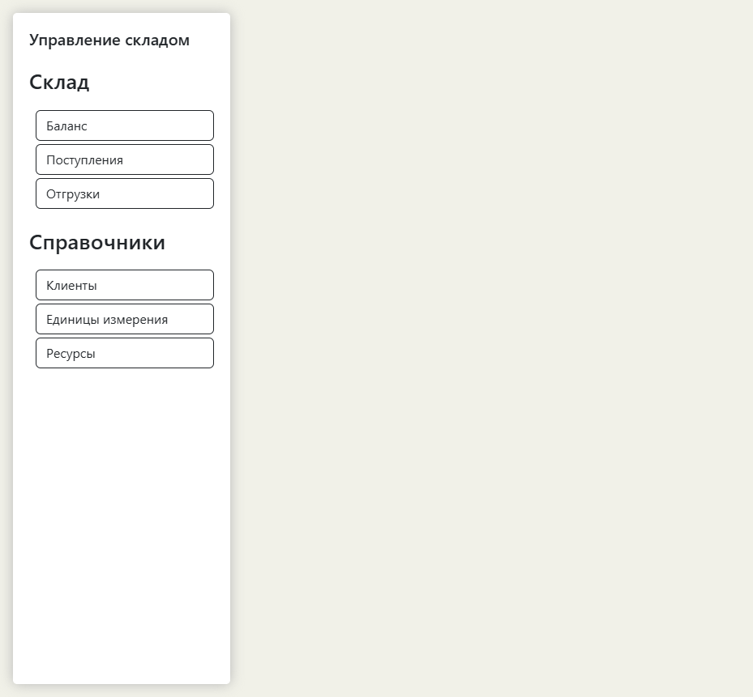
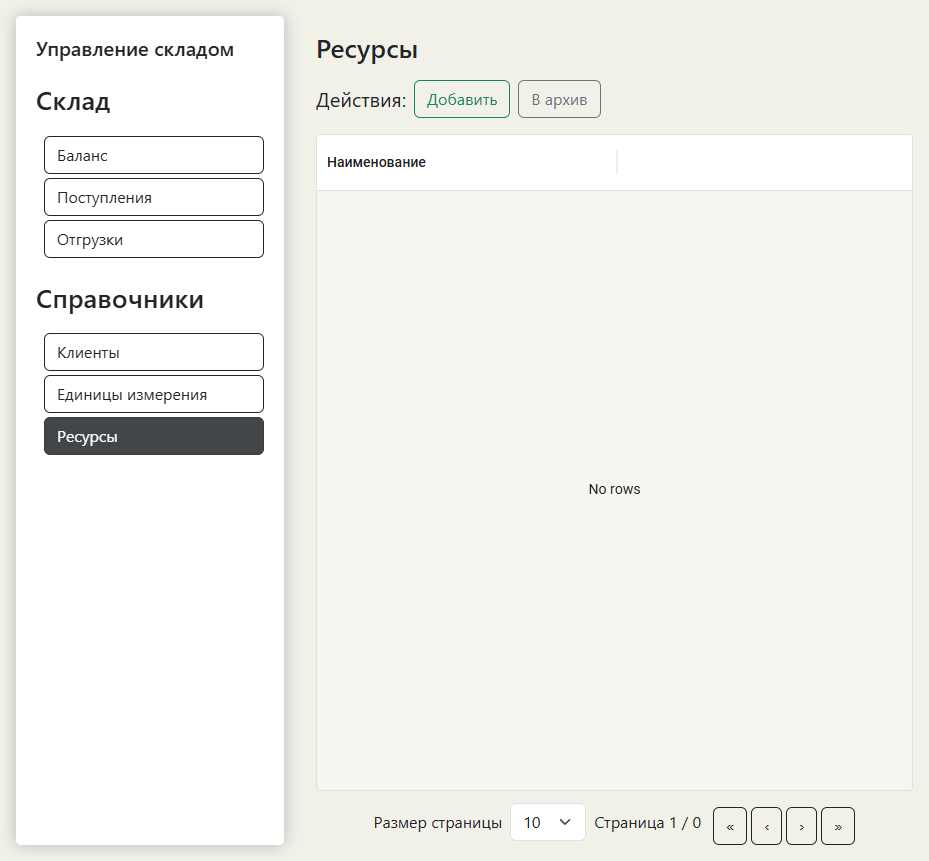

# Warehouse System


A full-stack warehouse management system (simplified). Built with **ASP.NET Core 9** on the backend and **React 19 + TypeScript + Vite** on the frontend.

[Русская версия](README.ru.md)

## Tech Stack

- **Backend:** ASP.NET Core 9, Entity Framework Core, PostgreSQL, Swashbuckle (OpenAPI/Swagger), Serilog, health checks
- **Frontend:** React 19, TypeScript, Vite, MUI, Axios, React Router
- **Architecture:** layered architecture (Contracts → Domain → Infrastructure → Application → Api)
- **DevOps:** Docker Compose, GitHub Actions CI, `.editorconfig`, `global.json`

## Quick Start (Docker Compose)

The fastest way to run the whole stack:

```bash
git clone https://github.com/DmitriyOT/Warehouse-System.git
cd WarehouseSystem
docker compose up --build
```

Then open http://localhost:3000.

- Frontend: http://localhost:3000
- Backend API: http://localhost:5001
- Backend health: http://localhost:5001/health

## Local Development

### Requirements

- [.NET 9 SDK](https://dotnet.microsoft.com/download)
- [Node.js 20+](https://nodejs.org/)
- [PostgreSQL](https://www.postgresql.org/)

### Backend

```bash
cp back/Warehouse.Api/appsettings.Development.json.example back/Warehouse.Api/appsettings.Development.json
# edit the connection string
cd back
dotnet restore
dotnet build
cd Warehouse.Api
dotnet run
```

API will be available at:
- HTTP: http://localhost:5189
- HTTPS: https://localhost:7291
- Swagger: https://localhost:7291/swagger

### Frontend

```bash
cp front/.env.example front/.env
# VITE_APP_API_URL=https://localhost:7291/
cd front
npm install
npm run dev
```

Open http://localhost:5173.

## Project Structure

```
WarehouseSystem
├── back/
│   ├── Warehouse.Contracts      # Shared interfaces, DTOs, exceptions
│   ├── Warehouse.Domain         # Domain models
│   ├── Warehouse.Infrastructure # EF Core, repositories, UoW, health checks
│   ├── Warehouse.Application    # Services and business logic
│   ├── Warehouse.Api            # API controllers and entry point
│   └── Warehouse.Tests          # Unit/integration tests
├── front/                       # React + TypeScript + Vite client
├── docker-compose.yml           # One-command stack (Postgres + backend + frontend)
└── .github/workflows/ci.yml     # CI: build + test backend, lint + build frontend
```

## Architecture Highlights

- **Unified API response** — every response is wrapped in `ResponseDTO` with `response`, `hasError`, `errorMessage`.
- **Layered backend** — separation of concerns for testability and readability.
- **Generic CRUD abstractions** — `CrudRepository`, `CrudService`, `BaseCrudController` with expression-tree filtering reduce boilerplate.
- **Balance transaction handling** — stock balance calculation is isolated in `BalanceService` and runs inside EF Core transactions.
- **Centralized frontend error handling** — a single modal context for errors.
- **Auto database migration** — EF Core migrations are applied on application startup.
- **Health checks** — `/health` and `/health/ready` endpoints for container orchestration.

## Screenshots

*Dashboard and directory pages running in Docker Compose.*




## CI

On every push or pull request to `main`:

1. **Backend:** restore → build → test → verify EF Core migrations are up to date.
2. **Frontend:** install → lint → build.

## License

MIT — see [LICENSE](LICENSE).
